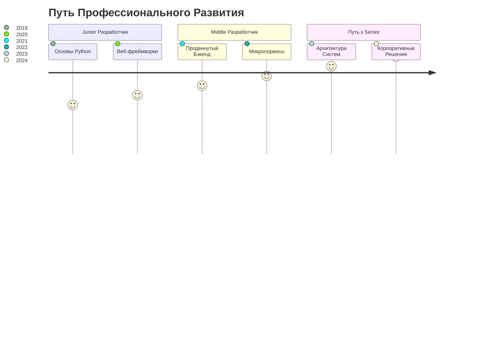

# 💻 Антон Молотило | Python Backend Инженер

  

## 🌟 Профессиональный обзор

### 🔬 Технологический Экосистема

  
  
  
  
  

### 💡 Профессиональные Компетенции
| 🚀 Бэкенд Разработка | 🔒 Проектирование Систем | 🌐 Инфраструктура |
|------------------------|--------------------------|-------------------|
| Продвинутое Python-программирование | Архитектура Микросервисов | Docker & Kubernetes |
| Экспертиза Django & FastAPI | Чистая Архитектура | CI/CD Пайплайны |
| Асинхронное Программирование | Оптимизация Производительности | Облачные Нативные Решения |

### 🏆 Ключевые Достижения
- 🌈 Разработка высоконагруженных распределенных систем
- 🔍 Внедрение передовых backend-архитектур
- 📊 Оптимизация производительности баз данных
- 🛡️ Усиление протоколов безопасности систем

### 🛠 Технические Навыки

  

### 📈 Траектория Профессионального Роста

### 🔬 Текущий Технологический Фокус
- 🤖 Интеграция Машинного Обучения
- 🔗 Блокчейн Технологии
- 🚀 Высокопроизводительные Вычисления
- ☁️ Облачно-Нативные Архитектуры

### 📊 Статистика GitHub

  
  

#### Трофеи GitHub

  

### 🌐 Профессиональная Сеть

  
  
  

### 💬 Давайте Общаться!
> "Инновации отличают лидера от последователя." - Стив Джобс

---

  

